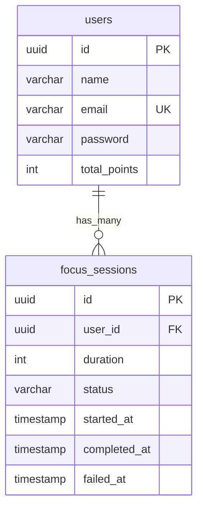

# codeFocus - Documento de Visão e Arquitetura

## 1. Visão Geral do Produto

O **codeFocus** é um aplicativo de produtividade focado em treinamento de atenção através de gamificação restritiva.

O objetivo não é bloquear aplicativos ou recursos do sistema operacional, mas criar uma consequência imediata para distrações. Sempre que o usuário sair do aplicativo durante uma sessão ativa, a sessão é considerada falha.

### Stack Tecnológica

* **Frontend:** React Native (Expo)
* **Backend:** Laravel 12
* **Banco de Dados:** PostgreSQL
* **Autenticação:** Laravel Sanctum
* **Design System:** Tech Minimalist
* **Tema:** OLED Black (`#000000`)

---

## 2. Objetivos do Produto

### Problema

Usuários frequentemente iniciam períodos de concentração, mas acabam interrompendo a atividade para verificar redes sociais, mensagens ou outros aplicativos.

### Solução

O codeFocus utiliza um sistema de penalização por distração:

* Entrou em uma sessão → inicia o foco.
* Saiu do aplicativo → falhou.
* Permaneceu até o fim → ganha pontos.

O sistema transforma atenção contínua em uma mecânica de progresso.

---

## 3. Regras de Negócio Core

### 3.1 Falha Automática

O aplicativo monitora o ciclo de vida através da API `AppState`.

Se uma sessão estiver ativa e ocorrer:

```text
active -> background
```

a sessão falha imediatamente.

### 3.2 Sistema de Pontuação

Ao concluir uma sessão:

```text
1 minuto = 1 ponto
```

Exemplo:

| Duração | Pontos |
| ------- | ------ |
| 15 min  | 15     |
| 25 min  | 25     |
| 45 min  | 45     |
| 60 min  | 60     |

Os pontos são acumulados no perfil global do usuário.

### 3.3 Timer Econômico

O cronômetro exibido na interface possui apenas função visual.

A validação oficial é realizada pelo backend.

Fluxo:

1. App inicia sessão.
2. Laravel registra `started_at`.
3. Usuário solicita conclusão.
4. Laravel verifica se o tempo mínimo foi cumprido.
5. Laravel aprova ou rejeita a conclusão.

### 3.4 Geração de UUID

Todas as sessões recebem um UUID V4 gerado pelo aplicativo.

Exemplo:

```json
{
  "id": "9e0efcb7-77c2-4c54-aec0-f5f44dfd4f5f"
}
```

---

## 4. Modelo de Dados

### users

| Campo        | Tipo      |
| ------------ | --------- |
| id           | uuid      |
| name         | varchar   |
| email        | varchar   |
| password     | varchar   |
| total_points | integer   |
| created_at   | timestamp |
| updated_at   | timestamp |

### focus_sessions

| Campo        | Tipo               |
| ------------ | ------------------ |
| id           | uuid               |
| user_id      | uuid               |
| duration     | integer            |
| status       | varchar            |
| started_at   | timestamp          |
| completed_at | timestamp nullable |
| failed_at    | timestamp nullable |
| created_at   | timestamp          |
| updated_at   | timestamp          |

### Status possíveis

```text
active
completed
failed
```

---

## 5. ERD



---

## 6. Contrato da API

### Headers Obrigatórios

```http
Accept: application/json
```

Após autenticação:

```http
Authorization: Bearer {token}
```

---

## 7. Autenticação

### Login

**POST**

```http
/api/login
```

Payload:

```json
{
  "email": "user@email.com",
  "password": "123456"
}
```

Resposta:

```json
{
  "token": "sanctum_token",
  "total_points": 0
}
```

---

### Registro

**POST**

```http
/api/register
```

Payload:

```json
{
  "name": "Vitor",
  "email": "vitor@email.com",
  "password": "123456"
}
```

Resposta:

```json
{
  "token": "sanctum_token"
}
```

---

## 8. Ciclo de Vida da Sessão

### Iniciar Sessão

**POST**

```http
/api/sessions/start
```

Payload:

```json
{
  "id": "uuid-v4",
  "duration": 25
}
```

Resposta:

```http
201 Created
```

---

### Concluir Sessão

**POST**

```http
/api/sessions/complete
```

Payload:

```json
{
  "id": "uuid-v4"
}
```

Resposta:

```json
{
  "new_total_points": 25
}
```

---

### Falhar Sessão

**POST**

```http
/api/sessions/fail
```

Payload:

```json
{
  "id": "uuid-v4"
}
```

Resposta:

```http
200 OK
```

---

## 9. Estrutura Laravel

```text
app/
├── Models
│   ├── User.php
│   └── FocusSession.php
│
├── Http
│   ├── Controllers
│   │   ├── AuthController.php
│   │   └── FocusSessionController.php
│   │
│   └── Requests
│       ├── LoginRequest.php
│       ├── StartSessionRequest.php
│       └── CompleteSessionRequest.php
│
└── Services
    └── FocusSessionService.php
```

---

## 10. Setup Backend (Laravel)

### Criar Projeto

```bash
composer create-project laravel/laravel codefocus-api
```

### Instalar Sanctum

```bash
composer require laravel/sanctum
```

Publicar:

```bash
php artisan vendor:publish --provider="Laravel\Sanctum\SanctumServiceProvider"
```

Rodar migrações:

```bash
php artisan migrate
```

---

### Configurar PostgreSQL

Arquivo `.env`

```env
DB_CONNECTION=pgsql
DB_HOST=127.0.0.1
DB_PORT=5432
DB_DATABASE=codefocus
DB_USERNAME=postgres
DB_PASSWORD=password
```

---

### Criar Model e Migration

```bash
php artisan make:model FocusSession -m
```

---

### Rodar Migrações

```bash
php artisan migrate
```

---

## 11. Setup Frontend (Expo)

### Criar Projeto

```bash
npx create-expo-app codefocus-app
```

### UUID

```bash
npx expo install react-native-get-random-values uuid
```

### Navegação

```bash
npx expo install @react-navigation/native
```

### Secure Storage

```bash
npx expo install expo-secure-store
```

### Configuração Visual

```css
background: #000000;
```

OLED puro para reduzir consumo energético.

---

## 12. Roadmap MVP

### Fase 1

* Cadastro
* Login
* Iniciar sessão
* Falhar sessão
* Concluir sessão
* Acúmulo de pontos

### Fase 2

* Ranking global
* Conquistas
* Estatísticas
* Histórico de sessões

### Fase 3

* Amigos
* Times
* Competições semanais
* Desafios de foco

---

## 13. Critérios de Sucesso

O MVP será considerado concluído quando:

* Usuário conseguir registrar conta.
* Usuário conseguir autenticar.
* Usuário iniciar sessão de foco.
* Saída do aplicativo causar falha automática.
* Sessão concluída gerar pontos.
* Pontuação persistir no PostgreSQL.
* API Laravel validar corretamente a duração das sessões.
